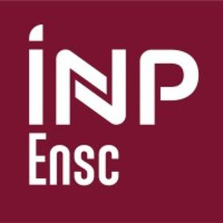

# Deep Learning short introductory course (spring 2022)

[Ecole Nationale Supérieure de Cognitique](https://ensc.bordeaux-inp.fr)

## Outline

- [The Python ecosystem](https://www.bpesquet.fr/mlhandbook/tools/python_ecosystem.html)
- [Artificial Neural Networks](https://www.bpesquet.fr/mlhandbook/algorithms/artificial_neural_networks.html)
- [Fashion-MNIST](https://www.bpesquet.fr/mlkatas/training/fashion_mnist.html)
- [Convolutional Neural Networks](https://www.bpesquet.fr/mlhandbook/algorithms/convolutional_neural_networks.html)
- [CIFAR10](https://www.bpesquet.fr/mlkatas/training/cifar10.html)
- (Bonus) [Dogs vs. cats](https://www.bpesquet.fr/mlkatas/training/dogs_vs_cats_keras.html)
